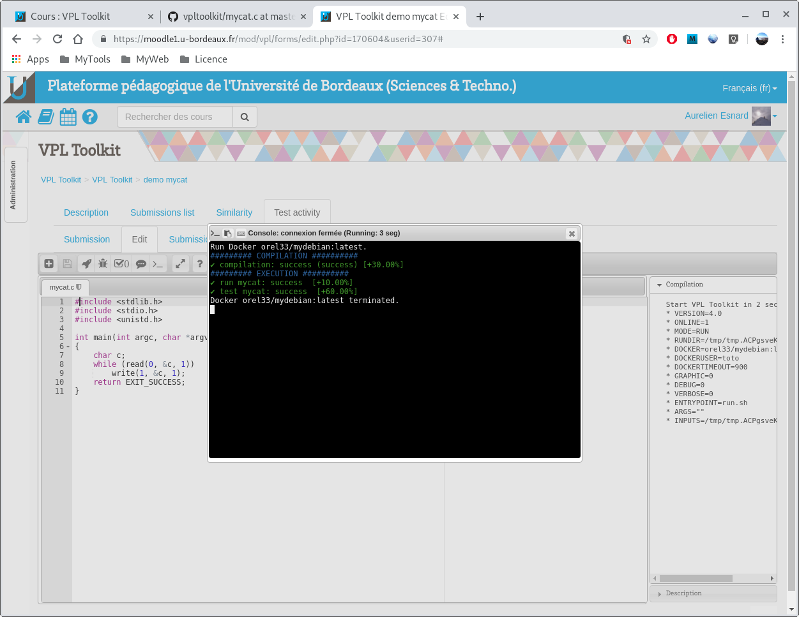
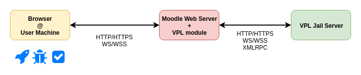
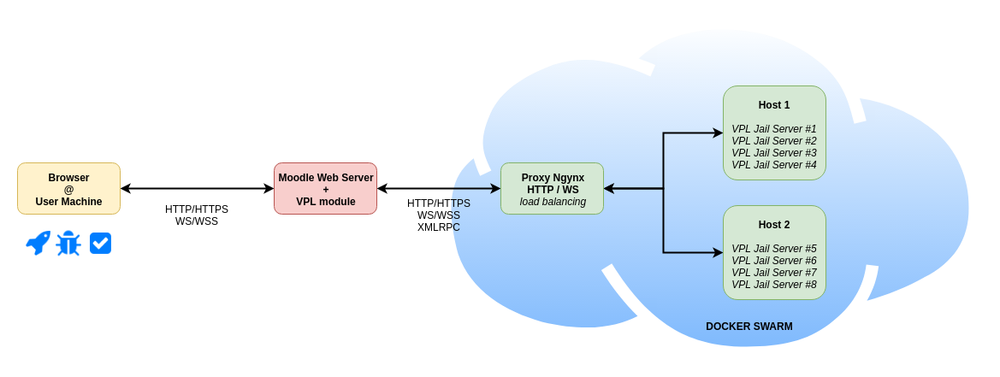
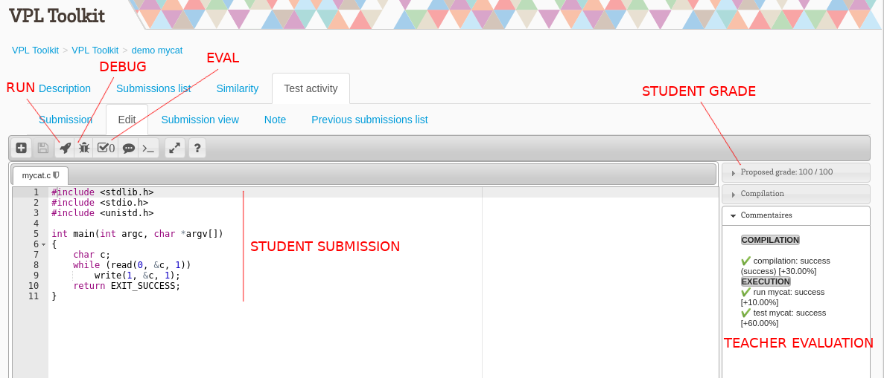
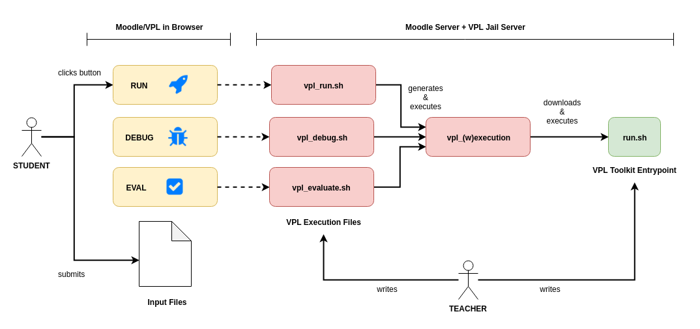
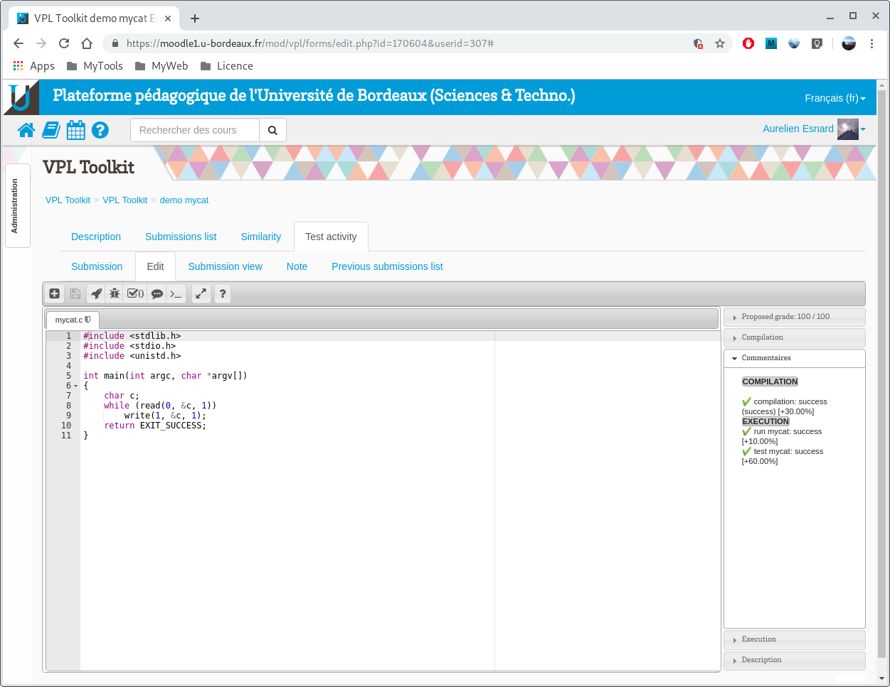

# VPL Toolkit in a Nutshell

<br>
<br>
<center><a url="https://github.com/orel33/vpltoolkit">https://github.com/orel33/vpltoolkit</a></center>
<center> ~ </center>
<center>aurelien.esnard@u-bordeaux.fr</center>
<br>
<br>

---

## Introduction

*VPL Toolkit* is a light shell toolkit to help *teachers* to program [VPL](http://vpl.dis.ulpgc.es/) activity in [Moodle](https://moodle.org/) for their *students*.

* extension of VPL execution model (start.sh)
* a toolkit with some basic *bash* functions for presentation & evaluation (toolkit.sh)
* offline execution using a local script (local.sh)
* docker support to enforce portability & reproducibility

<center></center>

---

## VPL Jail Server inside Docker

* Overview of a Basic VPL Jail Server

<center></center>

* Docker Infrastructure (G. Blin, University of Bordeaux)

<center></center>

→ VPL Jail Server runs inside a *docker container* and exposes the docker socket to enable nested docker containers (using docker images provided by teacher)...

---

## VPL Basics

* Teacher configures VPL activity and writes evaluation scripts in *bash*...
* Student submits input files and launches VPL in possibly three different execution modes:
  * __run mode__: interactive, no grade, text or graphic
  * __debug mode__: interactive, no grade, text or graphic
  * __eval mode__: non-interactive, compute grade, print comments for student

<center></center>

---

## VPL Execution Model

<center></center>

→ VPL Toolkit extends VPL execution model to make easier exercice deployment, presentation and local development...

---

## VPL Toolkit Extension

A typical VPL Toolkit exercice is *locally* organized as follow:

```text
$SRCDIR
  ├── run.sh              # default entrypoint script
  ├── test                # offline input test directory
  │   └── student1/...
  |   └── solution/...
  └── ...                 # extra exercice files (used by run.sh)
```

After online/offline deployment, the entrypoint script (*run.sh* by default) will start from the *$RUNDIR* directory (in /tmp/...), organized as follow:

```text
$RUNDIR
  ├── env.sh              # environment variable for the VPL toolkit
  ├── run.sh              # default entrypoint script
  ├── ...                 # exercice extra files (provided by teacher)
  ├── inputs              # all student input files ($VPL_SUBFILES)
  │   └── student.c
  |   └── ...
  └── vpltoolkit          # VPL toolkit
      └── start.sh        # startup script
      └── toolkit.sh      # useful bash routines
      └── ...
```

---

## Start VPL Toolkit: Steps 1 & 2

In Moodle, edit VPL execution files (`vpl_run.sh`, `vpl_debug.sh`, ...):

1) First, set VPL Toolkit variables:

```bash
RUNDIR=$(mktemp -d)                           # running directory
GRAPHIC=0|1                                   # text / graphic mode
DOCKER=""|"orel33/mydebian:latest"|...        # docker image published hub
DOCKERUSER=""|"toto"|"root"|...               # user to be used in docker container
DOCKERTIMEOUT=900|...                         # docker timeout
DEBUG=0|1                                     # debug mode
VERBOSE=0|1                                   # verbose mode
ENTRYPOINT="run.sh"|...                       # entrypoint
```

2) Download VPL Toolkit from GitHub and load `start.sh`...

```bash
( cd $RUNDIR && git clone "https://github.com/orel33/vpltoolkit.git" &> /dev/null )
[ ! $? -eq 0 ] && echo "⚠ Fail to download VPL Toolkit!" && exit 0
source $RUNDIR/vpltoolkit/start.sh || exit 0
```

---

## Start VPL Toolkit: Steps 3 & 4

3) Download teacher exercice from a GIT repository (or a web site)...

```bash
DOWNLOAD "https://github.com/orel33/vpltoolkit.git" "master" "demo/hello"
```

4) Then, call the START method...

```bash
START arg1 arg2 ...
```

→ It will copy all files in `$RUNDIR` and will call the entrypoint script `run.sh` with args...

---

## VPL Toolkit: run it

VPL Toolkit environment is provided at runtime in `env.sh`:

```bash
RUNDIR=$(mktemp -d)                           # running directory
GRAPHIC=0|1                                   # text / graphic mode
DOCKER=""|"orel33/mydebian:latest"|...        # docker image published hub
DEBUG=0|1                                     # debug mode
VERBOSE=0|1                                   # verbose mode
VERSION=4                                     # VPL Toolkit version used
ONLINE=0|1                                    # online / offline execution
MODE="RUN"|"DEBUG"|"EVAL"                     # VPL execution mode
ARGS="..."                                    # teacher arguments
INPUTS="..."                                  # directory with all student input files
```

A single entrypoint `run.sh` for the different execution modes...

```bash
#!/bin/bash

### initialization
source env.sh || exit 0
source vpltoolkit/toolkit.sh || exit 0
CHECKVERSION "4.0"
CHECKDOCKER "orel33/mydebian:latest"

### teacher script
ECHO "hello world!"
```

---

### My Cat Demo

C programming exercice of the Unix *cat* command: [mycat](https://github.com/orel33/vpltoolkit/tree/master/demo/mycat) 

* requested file:  `mycat.c` (student input)

```C
#include <stdlib.h>
#include <stdio.h>

int main(int argc, char* argv[])
{
    /* student code */
    return EXIT_SUCCESS;
}
```

* execution files: `vpl_run.sh` & `vpl_evauate.sh`

```bash
#!/bin/bash
RUNDIR=$(mktemp -d)
DOCKER="orel33/mydebian:latest"
( cd $RUNDIR && git clone "https://github.com/orel33/vpltoolkit.git" -b "4.0" &> /dev/null )
source $RUNDIR/vpltoolkit/start.sh
DOWNLOAD "https://github.com/orel33/vpltoolkit.git" "master" "demo/mycat"
START
```

---

### My Cat Demo (run.sh)

```bash
#!/bin/bash

### initialization & check
source env.sh || exit 1
source vpltoolkit/toolkit.sh || exit 1
GRADE=0
CHECKVERSION "4.0" || exit 1
CHECKDOCKER "orel33/mydebian:latest" || exit 1
CHECKPROGRAMS "gcc" "cat" "diff" || exit 1
[ ! -f inputs/mycat.c ] && ERROR "Input file mycat.c expected but not found!" && EXIT_GRADE 0

### compilation
TITLE "COMPILATION"
CFLAGS="-std=c99 -Wall"
TRACE "gcc $CFLAGS inputs/mycat.c -o mycat &> warnings"
EVAL $? "compilation" 10 0 || EXIT_GRADE 0
[ -s warnings ] && EVALKO 1 "compilation" -10 "warnings" && CAT warnings

### execution
TITLE "EXECUTION"
TRACE_TEACHER "echo \"abcdef\" > mycat.in"
TRACE_TEACHER "cat mycat.in | ./mycat > mycat.out"
EVAL $? "run mycat" 10 0
TRACE_TEACHER "diff -q mycat.in mycat.out"
EVAL $? "test mycat" 60 0

EXIT_GRADE
```

---

### My Cat Demo (Edit & Run)

<center></center>

---

### My Cat Demo (Eval)

<center></center>

---

## Local Script

**Key Idea**: test your VPL scripts or evaluate student work offline, independantly of Moodle/VPL framework...

```
$ ./local.sh -h
Usage: ./local.sh <download> [options] <...>
Start VPL Toolkit on localhost.
select <download> method:
    -l <localdir>: copy teacher files from local directory into <rundir>
    -r <repository>: download teacher files from remote git repository
    -w <url>: download teacher zip archive from remote web site
[options]:
    -L: use local version of VPL Toolkit
    -n <version> : set the branch/version of VPL Toolkit to use (default master)
    -m <mode>: set execution mode to RUN, DEBUG or EVAL (default RUN)
    -g : enable graphic mode (default no)
    -d <docker> : set docker image to be used (default, no docker)
    -u <dockeruser>: set docker user (-d required)
    -b <branch>: checkout a branch from git repository (default master, -r required)
    -p <password>: unzip teacher archive using a password (-w required)
    -s <subdir>: only download teacher files from subdir into <rundir>
    -e <entrypoint>: entrypoint shell script (default run.sh)
    -i <inputdir>: student input directory
    -v: enable verbose mode (default no)
    -D: enable debug mode (default no)
    -h: help
<...>: extra arguments passed to START routine in VPL Toolkit
```

---

## My Cat Demo: Local Execution

Test your script locally exactly in the same way as with Moodle/VPL:

```bash
$ ./local.sh -m RUN -d "orel33/mydebian:latest"     \
      -r "https://github.com/orel33/vpltoolkit.git" \
      -s demo/mycat -i demo/mycat/test/solution

Run Docker orel33/mydebian:latest.
######### COMPILATION ##########
✔️ compilation: success (success) [+30.00%]
######### EXECUTION ##########
✔️ run mycat: success  [+10.00%]
✔️ test mycat: success  [+60.00%]
Docker orel33/mydebian:latest terminated.


```

Oups, there is a bug! I need to update my VPL script and test it *offline*, and *locally* (option -l):

```bash
$ ./local.sh -m RUN -d "orel33/mydebian:latest" -l . -s demo/mycat -i demo/mycat/test/solution
```

Use -D option (for advanced debug) and get an interactive session in `$RUNDIR` after *run.sh* execution...

---

## VPL Toolkit API (version 4.0)

To present outputs and grades properly in different modes, we provide several useful *bash functions* in [toolkit.sh](https://github.com/orel33/vpltoolkit/blob/master/toolkit.sh).

```bash
# pretty print
function ECHO() / ECHO_TEACHER()
function PRE() / WARNING() / ERROR() / CRASH() / INFO()
function PRINTOK() / PRINTKO()

# title
function TITLE() / TITLE_TEACHER()

# print file
function CAT() / CAT_TEACHER()

# execute command
function TRACE() / TRACE_TEACHER()
function WAIT()

# evaluation & grade calculation
function EVALOK() / EVALKO() / EVAL()
function EXIT_GRADE()

# check
function CHECKVERSION() / CHECKDOCKER() / CHECKFILES() / CHECKPROGRAMS()
```

---

## VPL @ University of Bordeaux

* [Initiation Prog C]() (L1) & [Programmation C](https://moodle1.u-bordeaux.fr/course/view.php?id=3620) (L2 Info) : tous les TPs et le projet
* [Programmation Système](https://moodle1.u-bordeaux.fr/course/view.php?id=4249) (L3 Info) : exo entraînement (mycat, ...), projet *test framework*
* [Projet Techno](https://moodle1.u-bordeaux.fr/course/view.php?id=2930) (L2 Info) : jeu 2d, rendu GIT, make, cmake, sdl2, android, ...
* [Réseaux](https://moodle1.u-bordeaux.fr/course/view.php?id=4448) (L2 Info) : projet python *chat*, Catch The Flag (analyse de trame), Hack d'un réseau virtuel (qemunet)
* [Architecture des Ordinateurs](https://moodle1.u-bordeaux.fr/course/view.php?id=4345) (L2 Info) : assembleur y86, circuit (?)
* [BD Web](https://moodle1.u-bordeaux.fr/course/view.php?id=4434) (L1 Info) : rendu de projet et assistant graphique à la correction
* [Programation Fonctionnelle]() (L2 Info) : exo entraînement (OCaml)
* [Demo VPL Toolkit](https://moodle1.u-bordeaux.fr/course/view.php?id=4528)
* [VPL Pouet Pouet](https://moodle1.u-bordeaux.fr/course/view.php?id=4715)
